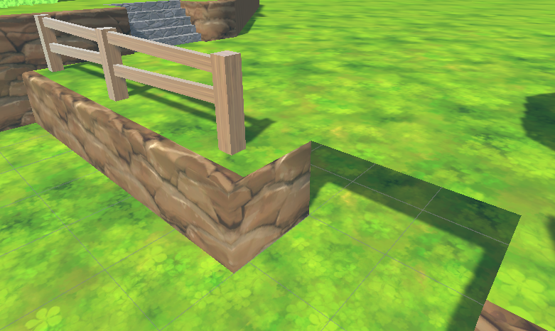

# TempustTerrain
Prototype tools for terrain generation using Unity's Spline package. 

## Ground
Generates ground terrain with a given height, bevel, and wall thickness.

### Edge Types
Click on an edge to toggle between three edge types:
1. Flat
2. Beveled
3. None

## TTRiver
Generate a river based on a spline with a given width and subdivisions.
